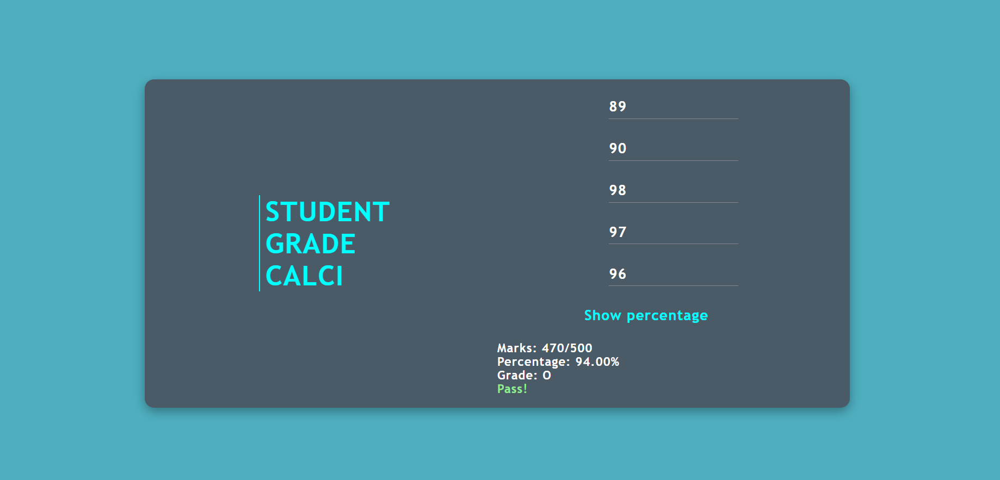
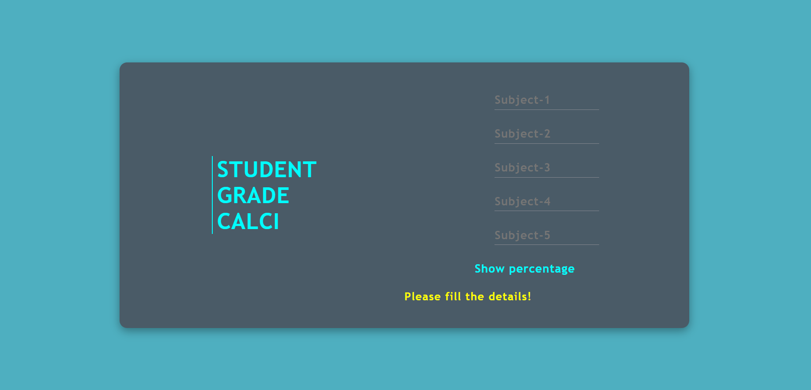
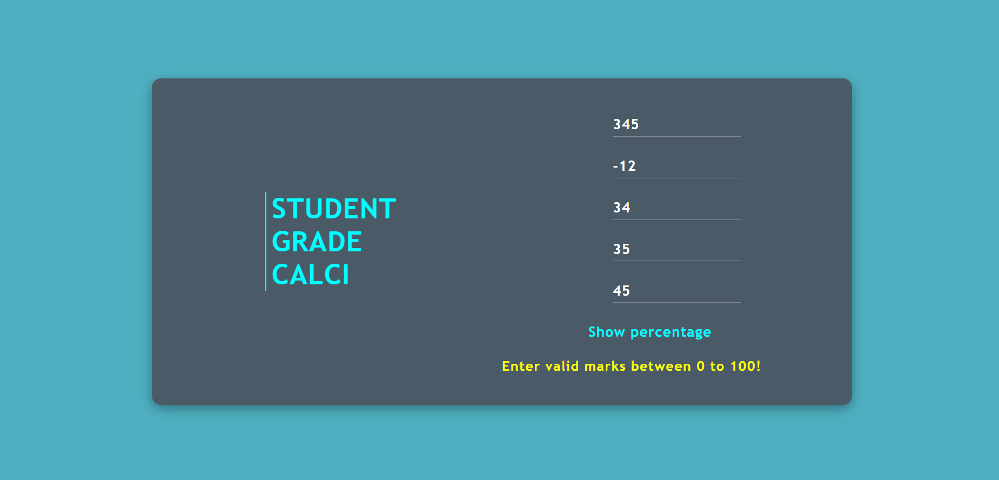

# Student Grade Calculator

## Overview

### This is a Project on JavaScript, to display result of student which includes total marks, percentage and grade!

#### There are certain criteria:
##### 1) If the user don't enter marks before submitting rather it be single or multiple, then it shows error!

##### 2) If the user enters negative marks or greater than 100 then it shows error!

## My process

### Built with

- Visual Studio Code
- Semantic HTML5 markup
- CSS custom properties
- Flexbox
- CSS
- JavaScript
- Mobile-first workflow
- [React](https://reactjs.org/) - JS library
- [Next.js](https://nextjs.org/) - React framework

## Author

- Linkedin - [Sonu-Dutta](https://www.linkedin.com/in/sonu-dutta-6900b3218)
- Twitter - [@sonudutta9999](https://mobile.twitter.com/sonudutta9999)

